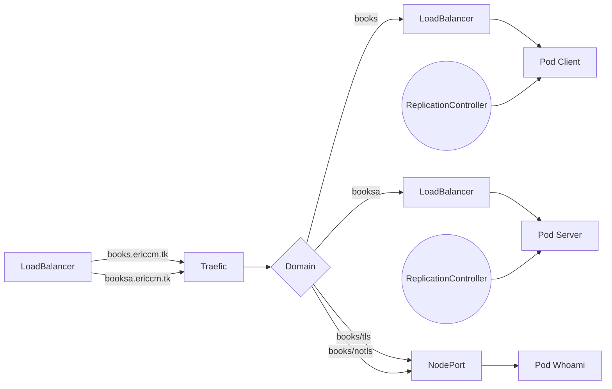

# kubernetesbooks
## Diseño:
Estructura del proyecto:
Usaremos archivos ```.jar```(ejecutables) como aplicativos de frontEnd(le llamaremos "cliente") y backEnd(lo llamaremos "servidor")
La etiqueta "Java" serán nuestros aplicativos creados con "Java Spring Boot".


```
graph LR
P[Java] --> A[Jar]
P --> X((Github)) --> P
A -- build--> B[Docker]
B -- push -->C((Docker Hub))
C -- create pod --> D[kubernetes] 
```
En esta imagen podemos observar que nuestro código java tendrá control de versiones con Git usando Github. Una vez nuestro cádigo sea el deseado o en su defecto una versión que queramos deployar se creara el archivo "jar", este será usado para crear una imagen "Docker" la cual será subida a DockerHub desde donde se obtendrá para crear los pods en kubernetes.
<br/>

------------
<br/>
Diseño de la estructura en kubernetes:

Usaremos un "LoadBalancer" delante de todo para poder replicar nuestro sistema en tantos nodos como necesitemos.
También usaremos "Traefic" como nuestro servicio de "Ingress".
En este caso usaremos 2 dominios, uno que será tanto para nuestro servicio cliente y un "whoais" y otro para nuestro servicio servidor.


<br/>

------------
<br/>

## implementación:

### Crear los archivos "Jar":

Estos por ahora los creamos usando la herramienta "Eclipse" eligiendo construirlas con "Maven".
Podrían crearse directamente a la hora de crear la imagen de Docker y descargando el código de GitHub, pero por motivos de complejidad y falta de tiempo he decidido hacerlo así.
[GitHub Cliente](https://github.com/mricim/booktestClient)
[GitHub Servidor]()
Necesitaremos pasar al "cliente" la URL donde encontrar a la parte "servidor" para eso usaremos una variable "ENV" en el Dockerfile y será leída con `System.getenv().get("URL_SERVER_BOOKS")` en el código Java.
<br/>

------------

### Montar los Dockerfiles (Cliente/Servidor)
Necesitamos que el archivo .jar se encuentre en el mismo lugar que el archivo Dockerfile dado los comandos aquí expuestos.
#### Dockerfile Client
```
FROM adoptopenjdk/openjdk11:alpine-jre
MAINTAINER mricim
#environment variable with default value
#ENV URL_SERVER_BOOKS=dev
COPY springbootClient-0.0.1-SNAPSHOT.jar exemple1.jar
ENV PORT 8081
EXPOSE 8081
ENTRYPOINT ["java","-jar","exemple1.jar"]
```
Build DockerFile `sudo docker build -t mricim/book_test_client:initial .`

Push to [DockerHub Client](https://hub.docker.com/repository/docker/mricim/book_test_client)
`sudo docker push mricim/book_test_client:initial`

#### Dockerfile Server
```
FROM adoptopenjdk/openjdk11:alpine-jre
MAINTAINER mricim
COPY booktestdevop-0.0.1-SNAPSHOT.jar exemple1.jar
EXPOSE 8086
ENTRYPOINT ["java","-jar","exemple1.jar"]
```
Build DockerFile `sudo docker build -t mricim/booktestserver:initial .`

Push to [DockerHub Server](https://hub.docker.com/repository/docker/mricim/booktestserver)
`sudo docker push mricim/booktestserver:initial`
<br/>

------------

### Kubernetes
(Los archivos que se encuentran en este repositorio)
#### Requisitos:
- Tener instalado el cliente de Kubernetes "kubectl"
- Hacer login en [DigitalOcean](https://www.digitalocean.com/) o en nuestro servidor de kubernetes.
- Registrar un dominio en [DigitalOcean](https://www.digitalocean.com/) (en mi caso "ericcm.tk")

  
#### Crear nuestro nodo
Este proceso lo hacemos vía WEB en [DigitalOcean](https://www.digitalocean.com/) o podemos usar un creador como [Terraform](https://www.terraform.io/)


Necesitamos exportar la variable "KUBECONFIG" para poder ejecutar "kubectl" para conectarnos a [DigitalOcean](https://www.digitalocean.com/)
Ejemplo: `export KUBECONFIG=~/.kube/k8s-1-21-5-do-0-fra1-1638294733999-kubeconfig.yaml`
#### Crear la infraestructura de kubernetes

------------
###### Opcional
Podemos crear un "NameSpace" para dividir nuestro espacios de trabajo (Creara "nodos" virtualizados, llamados "subnodos")
Contenido del archivo "namespace.yml"

```
kind: Namespace
apiVersion: v1
metadata:
 name: testbooksspring
```
`kubectl apply -f namespace.yml`
Si usamos esta opción deberemos usar `-n testbooksspring` para usar esos subnodos. Dejo un ejemplo de como usarlo para crear un pod, por ejemplo: `kubectl apply -n testbooksspring  -f clientServiceLoadBalancer.yml`
###### Fin opcional


------------
Comprobamos que tenemos nodos:
`kubectl get nodes -o wide`
Con este mismo comando también podemos ver las ip de nuestros nodos.

Nos descargamos/clonamos el contenido de este repositorio y tenemos que ejecutar desde dentro de la carpeta descargada/clonada:
`kubectl apply .`
al realizar esta acción se crearan todos los pods con sus respectivos servicios. Podemos ejecutar `kubectl get all` para comprobar la creación:

Ahora debemos copiar la **ip externa** del `service/tcp-loadbalancer` en nuestro dominio creado en [DigitalOcean](https://www.digitalocean.com/) 


Una vez pasen algo mas de 60 segundos deberemos ejecutar `kubectl delete pod/traefik-xxxxxxxxx` para que se generen los certificados, que no se habían generado ya que la ip no estaba apuntando a nuestros dominios

##### Extra code
Podemos incluir `livenessProbe` y `readinessProbe` para comprobar que nuestros pods están vivos y listos para ejecutarse respectivamente:
```
apiVersion: v1
kind: ReplicationController
metadata:
  name: springbooktestclient
spec:
  replicas: 5
  template:
    metadata:
      labels:
        app: springbooktestclient
#        role: springbooktestclient
    spec:
      containers:
      - name: springbooktestclient
        image: mricim/book_test_client:initial
        imagePullPolicy: Always
        ports:
          - containerPort: 8081
        env:
        - name: URL_SERVER_BOOKS
          value: "https://booksa.ericcm.tk"
#Check start container
        livenessProbe:
          httpGet:
            path: /
            port: 8081
            httpHeaders:
            - name: X-Custom-Header
              value: Awesome
          initialDelaySeconds: 10
          periodSeconds: 3
#          failureThreshold: 1
#Check ready container
        readinessProbe:
          httpGet:
            path: /books/libraryp
            port: 8081
#            httpHeaders:
#            - name: X-Custom-Header
#              value: Awesome
          initialDelaySeconds: 6
          periodSeconds: 5
          successThreshold: 1
          timeoutSeconds: 1
```
<br/>

Si no queremos usar "LoadBalancer" como servicio en el archivo "02-services.yaml"  podemos comentarlo para que se use un "NodePort" que es el que se usa por defecto:
```
apiVersion: v1
kind: Service
metadata:
  name: springbooktestclient
spec:
#  type: LoadBalancer
  ports:
    - protocol: TCP
      name: web
      port: 80
      targetPort: 8081
  selector:
    app: springbooktestclient
```

##### Comandos de interes
`kubectl get svc` Obtendremos todos y solo los servicios

`kubectl describe pod springbooktestclient` Nos devolverá la descripción completa de un pod

`kubectl logs pod springbooktestclient` Nos retorna los logs de ese pod
