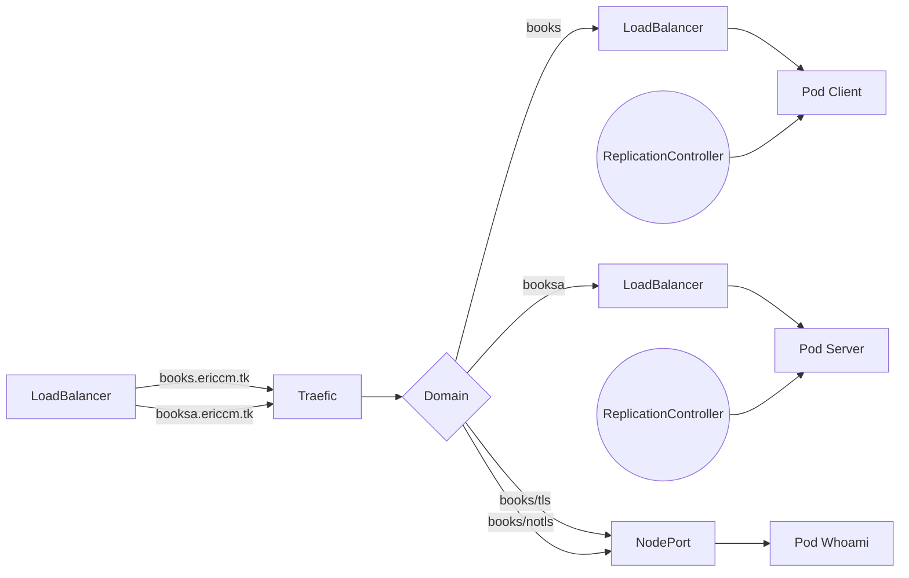

# kubernetesbooks


```
graph LR
P[Java] --> A[Jar]
P --> X((Github)) --> P
A -- build--> B[Docker]
B -- push -->C((Docker Hub))
C -- create pod --> D[kubernetes] 
```



```mermaid
graph LR
A[LoadBalancer] --  books.ericcm.tk --> B[Traefic]
A -- booksa.ericcm.tk --> B
B --> C{Domain}
C -- books--> D[LoadBalancer]
C -- booksa --> X[LoadBalancer]
C -- books/tls --> K[NodePort]
C -- books/notls --> K[NodePort]
D --> E[Pod Client]
X --> M[Pod Server]
K --> N[Pod Whoami]
G((ReplicationController)) --> E
F((ReplicationController)) --> M
```
